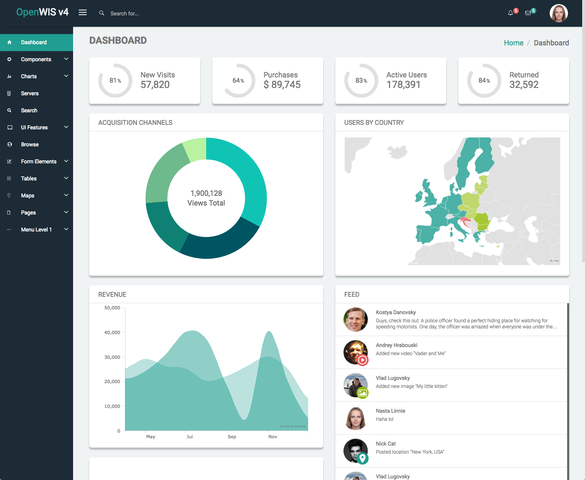
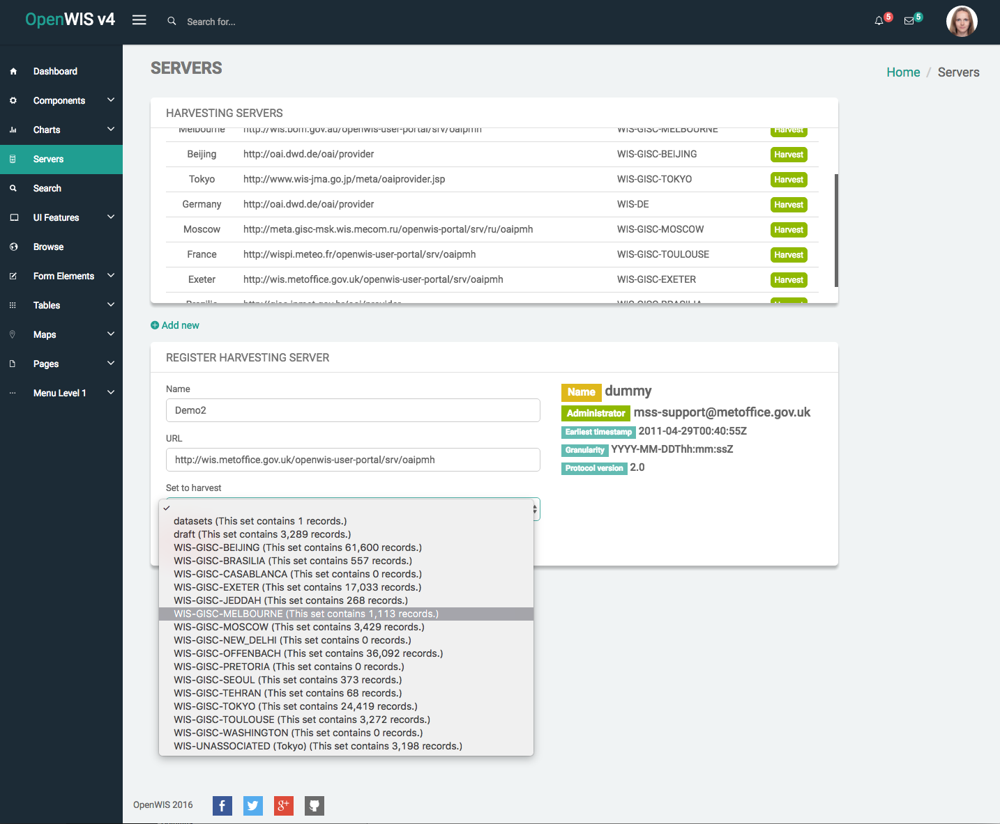
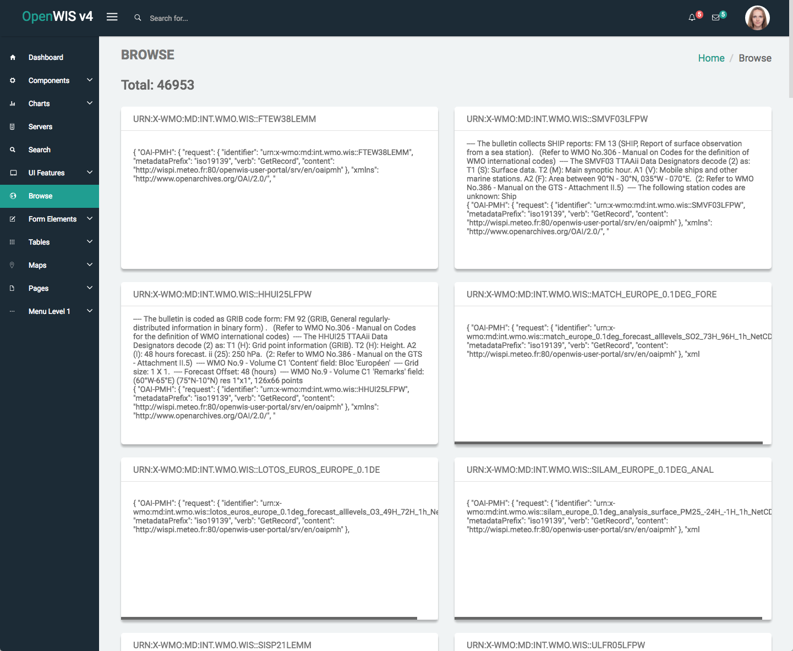
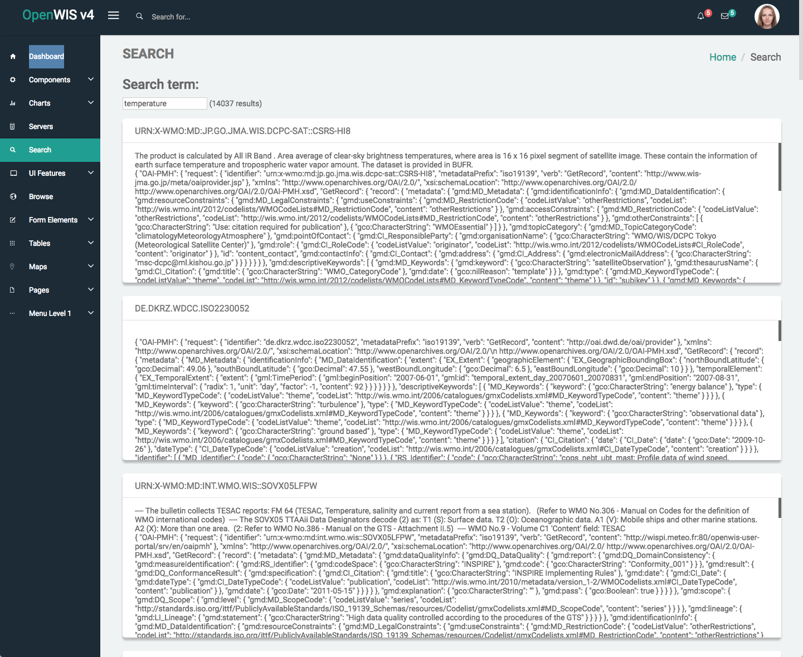
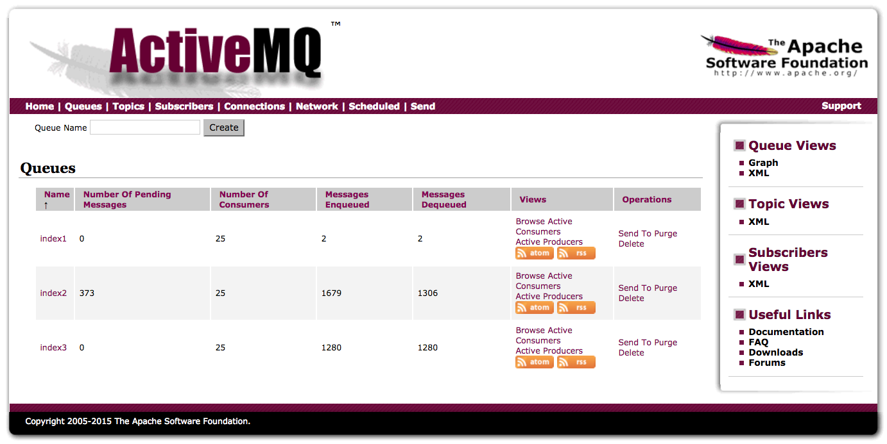
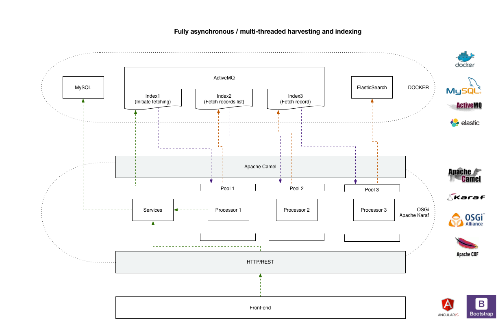
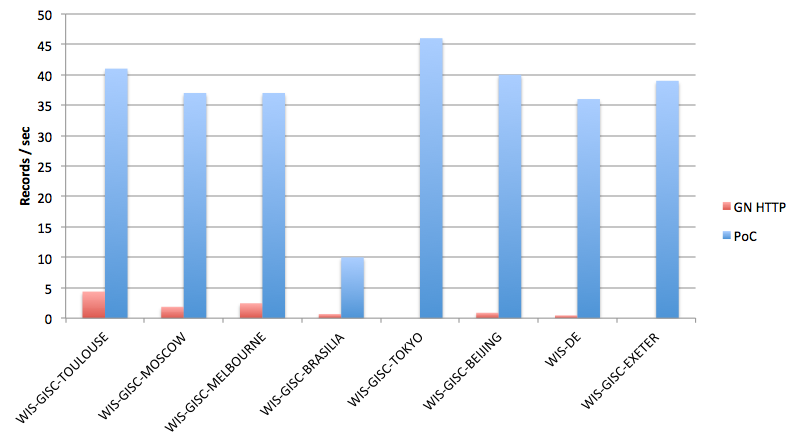

#OpenWIS - Technical Proof of Concept
This is a quick (<5 pdays spent) PoC demonstrating a few different technologies 
as well as architectural techniques that may be used in future versions of
OpenWIS. In particular:

- A modern, highly-responsive UI, with a plethora of ready-made components that
can be reused via [blur-admin](https://github.com/akveo/blur-admin).
- Transition to a complete message-driven architecture for harvesting and
indexing using [ActiveMQ](http://activemq.apache.org/).
- Configuration-based binding of business logic with message processing 
via [Apache Camel](http://camel.apache.org/).
- Micro-services architecture using OSGi via [Apache Karaf](http://karaf.apache.org/).
- Usage of [Elastisearch](https://www.elastic.co/) for data indexing. 

## Screenshots
### Home

### Adding a new server to harvest from

### Browsing indexed results from Elasticsearch

### Searching via Elasticsearch

### Monitoring ActiveMQ queues statistics

## Architecture diagram

## Benchmarks against GeoNetwork (out of the box configuration)

## Try it out!
Provided you have a Docker + Docker Compose in place, you can install & boot the PoC with the following one-liner:  
`curl https://raw.githubusercontent.com/NMichas/OpenWIS-PoC/master/docker-compose.yml | docker-compose -f - up`

If your Docker Engine is behind a proxy, you can inject your proxy's info as:  
`curl https://raw.githubusercontent.com/NMichas/OpenWIS-PoC/master/docker-compose.yml | HTTP_PROXY=http://proxy:port docker-compose -f - up`

Docker-compose is done initialising your local installation when you see in the console:  

    Index initialised.
    Mapping debugging disabled.
    
Then you can access the PoC on:  
[http://localhost:8181](http://localhost:8181)

_If you performed the installation on a remote machine, please change `localhost` 
to the IP/domain of your remote machine_